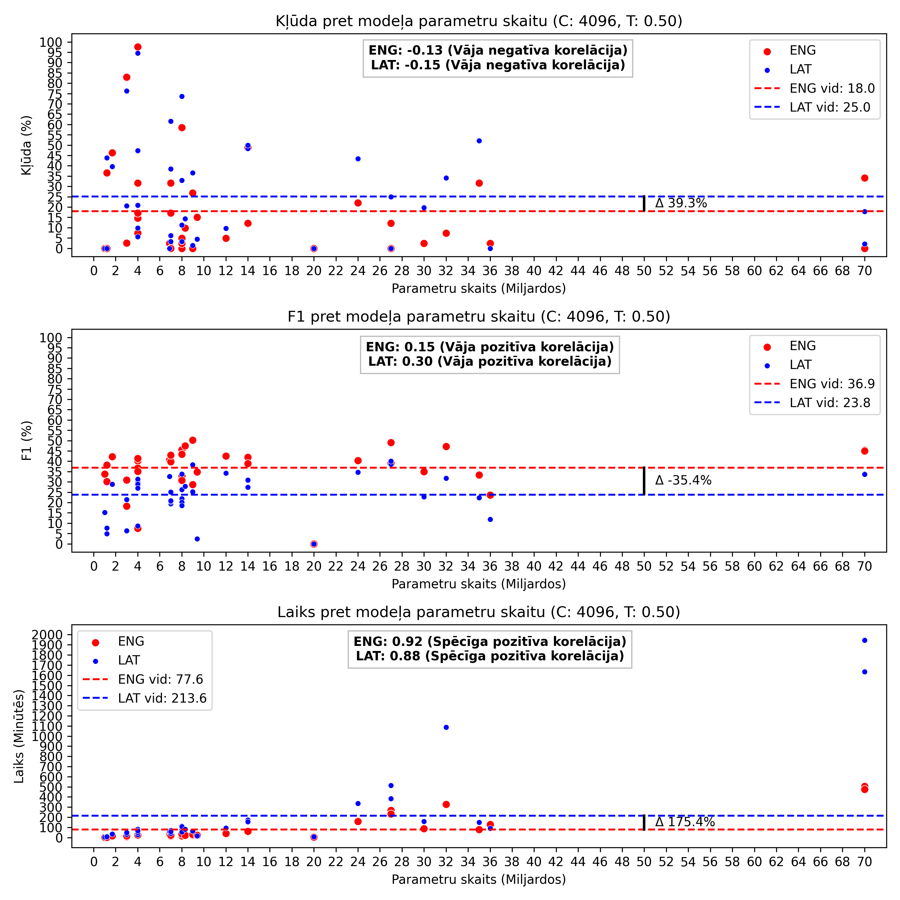
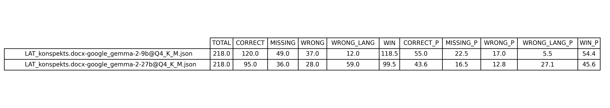
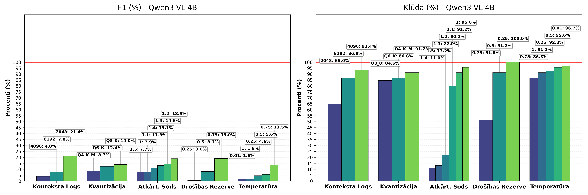

# Eksperimenti
Šeit var apskatīt visus veiktos eksperimentus, izmantotās datu kopas un rezultātus.

## Zelta standarts
- [Vardnica.xml](exper1/goldset/Vardnica.xml) / [Vardnica.json](exper1/goldset/Vardnica.json) (Latviešu valoda)
- [Glossary.xml](exper1/goldset/Glossary.xml) / [Glossary.json](exper1/goldset/Glossary.json) (Angļu valoda)

## Ievaddati (studiju materiālu konspekts)
- [LAT_konspekts.docx](exper1/input/LAT_konspekts.docx) (latviešu valoda)
- [ENG_konspekts.docx](exper1/input/ENG_konspekts.docx) (angļu valoda)

## Eksperiments 1
Šajā eksperimentā tika salīdzinātas visu modeļu iegūtās vārdnīcas gan angļu, gan latviešu valodā, lai noteiktu labāko modeli.

- Katra modeļa atsevišķos rezultātus var aplūkot šeit: [NOKLIKŠĶINI](exper1/output).
- Kopējo salīdzinājumu var aplūkot failos ar nosaukumiem [LAT_metrics.txt](exper1/eval/LAT_metrics.txt) un [ENG_metrics.txt](exper1/eval/ENG_metrics.txt).
- Salīdzinājuma grafiku, kurā tika salīdzinātas visu modeļu kļūdas, F1 mērs un laiks atkarībā no parametru skaita, var aplūkot failā ar nosaukumu [LAT_ENG_metrics.png](exper1/eval/LAT_ENG_metrics.png).

## Eksperiments 2
Šajā eksperimentā tika manuāli salīdzināti divu modeļu rezultāti: Gemma 2 9B un Gemma 2 27B.

- Salīdzinājuma novērtējumu var aplūkot failā ar nosaukumu [LAT_manual_eval.txt](exper1/eval/LAT_manual_eval.txt).
- Salīdzinājuma iegūtos rezultātus var aplūkot failā ar nosaukumu [LAT_manual_eval.png](exper1/eval/LAT_manual_eval.png).

## Eksperiments 3
Šajā eksperimentā tika salīdzināti trīs modeļu (Gemma 2 9B, Gemma 2 27B un Qwen3 VL 4B) rezultāti ar dažādiem iestatījumiem, lai noteiktu, kādi iestatījumi ietekmē modeļa kļūdu un veiktspēju, izmantojot latviešu valodas materiālus.

- Katra modeļa atsevišķos rezultātus var aplūkot šeit: [NOKLIKŠĶINI](exper2/output).
- Kopējo salīdzinājumu var aplūkot failā ar nosaukumu [LAT_metrics_groups.txt](exper2/eval/LAT_metrics_groups.txt).
- Salīdzinājuma grafiku modelim Qwen3 VL 4B, kurā var redzēt kļūdas un F1 mēra ietekmi atkarībā no iestatījumiem, var aplūkot failā ar nosaukumu [LAT_eval_groups.png](exper2/eval/LAT_eval_groups.png).

